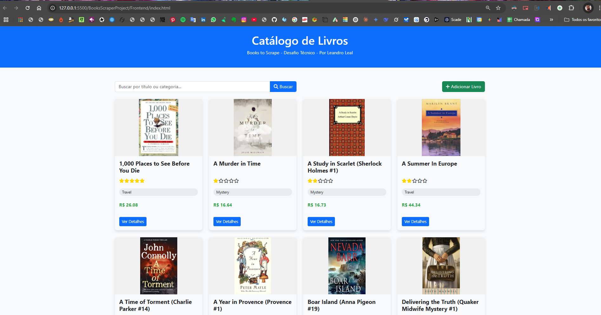

# Desafio Técnico - Coleta de Dados de Livros com RPA

Este projeto implementa uma solução completa para coletar dados do site **Books to Scrape**, armazená-los em um banco de dados PostgreSQL e disponibilizá-los através de uma API REST e interface web.


## 📑 Índice

- [Visão Geral](#visão-geral)
- [Arquitetura](#arquitetura)
- [Requisitos do Sistema](#requisitos-do-sistema)
- [Configuração e Instalação](#configuração-e-instalação)
- [Execução](#execução)
- [Componentes](#componentes)
  - [Worker Service](#worker-service)
  - [API REST](#api-rest)
  - [Frontend](#frontend)
- [Banco de Dados](#banco-de-dados)
- [Docker](#docker)
- [Resolução de Problemas](#resolução-de-problemas)

## Visão Geral

Este projeto realiza o scraping do site Books to Scrape, coletando informações detalhadas sobre os livros disponíveis, como título, preço, estoque, avaliação, URL da imagem e categoria. Estes dados são armazenados em um banco de dados PostgreSQL e podem ser acessados através de uma API RESTful ou visualizados em uma interface web.

A solução está dividida em três componentes principais:

1. **Worker Service (.NET)**: Realiza o scraping periódico do site e armazena os dados no banco.
2. **API CRUD (ASP.NET Core 8)**: Fornece endpoints para acessar e manipular os dados dos livros.
3. **Frontend (HTML + JS Vanilla)**: Interface de usuário para visualização e interação com os dados.

## Arquitetura

A solução segue uma arquitetura de três camadas, com separação clara de responsabilidades:

```
Books to Scrape Website
       ↓
Worker Service (.NET)
       ↓
    PostgreSQL
       ↑
API REST (ASP.NET Core)
       ↑
Frontend (HTML + JS)
```

## Requisitos do Sistema

- [.NET 8 SDK](https://dotnet.microsoft.com/download/dotnet/8.0)
- [PostgreSQL 12+](https://www.postgresql.org/download/)
- [Visual Studio Code](https://code.visualstudio.com/) ou IDE similar (opcional)
- [Docker](https://www.docker.com/products/docker-desktop) (opcional, para execução com Docker Compose)

## Configuração e Instalação

### 1. Clonar o Repositório

```bash
git clone https://github.com/seu-usuario/bookscraper-project.git
cd bookscraper-project
```

### 2. Configurar o Banco de Dados PostgreSQL

```bash
# Criar o banco de dados
createdb -U postgres bookscraper

# Executar o script de criação das tabelas
psql -U postgres -d bookscraper -f Database/create_tables.sql
```

O script SQL para criação da tabela é:

```sql
CREATE TABLE IF NOT EXISTS livros (
    id UUID PRIMARY KEY,
    titulo TEXT NOT NULL,
    preco NUMERIC NOT NULL,
    estoque TEXT,
    avaliacao INT,
    imagem_url TEXT,
    categoria TEXT
);

CREATE INDEX IF NOT EXISTS idx_livros_titulo ON livros(titulo);
CREATE INDEX IF NOT EXISTS idx_livros_categoria ON livros(categoria);
```

### 3. Configurar as Strings de Conexão

#### Worker Service (BookScraperWorker/appsettings.json)

```json
{
  "ConnectionStrings": {
    "DefaultConnection": "Host=localhost;Database=bookscraper;Username=postgres;Password=SuaSenha"
  },
  "ScrapingIntervalInHours": 6
}
```

#### API (BooksAPI/appsettings.json)

```json
{
  "ConnectionStrings": {
    "DefaultConnection": "Host=localhost;Database=bookscraper;Username=postgres;Password=SuaSenha"
  }
}
```

### 4. Restaurar Dependências

```bash
# Para o Worker Service
cd BookScraperWorker
dotnet restore

# Para a API
cd ../BooksAPI
dotnet restore
```

## Execução

### Execução Manual dos Componentes

#### 1. Worker Service
```bash
cd BookScraperWorker
dotnet run
```

O Worker Service iniciará e realizará o scraping do site Books to Scrape, armazenando os dados no banco PostgreSQL. O scraping será repetido de acordo com o intervalo configurado.

#### 2. API
```bash
cd BooksAPI
dotnet run
```

A API estará disponível em http://localhost:5015/api/livros

#### 3. Frontend
Abra o arquivo `Frontend/index.html` em um navegador web ou utilize a extensão Live Server do VSCode para servir o frontend.


## Componentes

### Worker Service

O Worker Service é responsável por coletar periodicamente os dados do site Books to Scrape e armazená-los no banco de dados.

#### Características:
- Coleta de dados completa do site
- Processamento resiliente e idempotente
- Agendamento periódico (padrão: 6 horas)
- Logging detalhado das operações

### API REST

A API fornece endpoints para acessar e manipular os dados dos livros armazenados no banco.

#### Endpoints:
- `GET /api/livros`: Lista paginada de livros (suporta parâmetros de paginação e busca)
- `GET /api/livros/{id}`: Detalhes de um livro específico
- `POST /api/livros`: Inserção manual de novos livros
- `PUT /api/livros/{id}`: Atualização dos dados de um livro
- `DELETE /api/livros/{id}`: Exclusão de um livro

#### Parâmetros de Busca e Paginação:
- `search`: Termo para filtrar por título ou categoria
- `pageNumber`: Número da página (padrão: 1)
- `pageSize`: Quantidade de itens por página (padrão: 10, máximo: 50)

### Frontend

A interface web permite visualizar e interagir com os dados dos livros de forma amigável.

#### Funcionalidades:
- Visualização em grid dos livros com paginação
- Exibição dos dados principais (título, imagem, preço, avaliação)
- Modal de detalhes com informações completas
- Formulário para adição e edição de livros
- Busca por título ou categoria
- Ordenação alfabética dos resultados

## Banco de Dados

O banco de dados PostgreSQL armazena as informações coletadas dos livros.

### Estrutura da Tabela:

```
livros (
    id UUID PRIMARY KEY,
    titulo TEXT NOT NULL,
    preco NUMERIC NOT NULL,
    estoque TEXT,
    avaliacao INT,
    imagem_url TEXT,
    categoria TEXT
);
```

## Docker

O projeto inclui arquivos Docker e Docker Compose para facilitar a implantação.

### Execução com Docker Compose

Execução com Docker
Para executar o projeto com Docker, siga estas etapas:

Instalação do Docker:

Instale o Docker Desktop em: https://www.docker.com/products/docker-desktop
Após a instalação, inicie o Docker Desktop


Ajuste no Frontend:

IMPORTANTE: Antes de iniciar, você precisará modificar temporariamente o arquivo Frontend/js/app.js
Mude a linha:
javascriptconst API_URL = 'http://localhost:5015/api';

Para:
javascriptconst API_URL = 'http://localhost:8080/api';

Após usar o Docker, você pode revertê-la para a configuração original


Iniciar os Containers:
docker-compose up -d

Este comando iniciará o PostgreSQL, a API e o Worker em containers separados
A API estará disponível em: http://localhost:8080/api/livros


Abrir o Frontend:

Abra o arquivo Frontend/index.html no navegador
Ou use o Live Server do VS Code


Encerrar os Containers:
docker-compose down

Use este comando quando terminar de usar a aplicação


Lembre-se: Depois de terminar, restaure a URL original no arquivo app.js se for voltar à execução local.


### Estrutura Docker:

```yaml
services:
  postgres:
    # Configuração do PostgreSQL
    
  api:
    # Configuração da API
    
  worker:
    # Configuração do Worker Service
```

## Resolução de Problemas

### Problemas Comuns:

#### 1. Erro de Conexão com o Banco de Dados
- Verifique se o PostgreSQL está em execução
- Confirme se as strings de conexão estão corretas
- Verifique se o banco de dados e a tabela existem

#### 2. API Não Responde
- Confirme se a porta não está sendo utilizada por outro serviço
- Verifique os logs da aplicação para identificar possíveis erros

#### 3. Worker Service Não Coleta Dados
- Verifique a conectividade com o site Books to Scrape
- Confirme se o banco de dados está acessível
- Verifique os logs para mensagens de erro detalhadas

#### 4. Frontend Não Carrega os Dados
- Verifique se a URL da API no arquivo app.js está correta
- Abra o console do navegador para identificar possíveis erros
- Confirme se a API está em execução e respondendo corretamente

---

## Autor

Desenvolvido por Leandro Leal como parte do Desafio Técnico.

## Licença

Este projeto está licenciado sob a Licença MIT